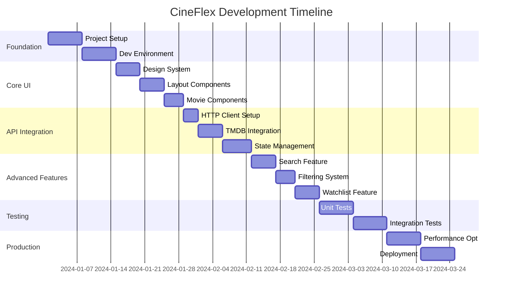

# 🗺️ CineFlex Development Roadmap
## From Zero to Production-Ready Movie Discovery App

<div align="center">

[](https://reactjs.org/)
[](https://www.typescriptlang.org/)
[](https://vitejs.dev/)

*A comprehensive 12-week development plan to build a production-ready movie discovery application*

</div>

---

## 📋 Table of Contents

- [🎯 Overview](#-overview)
- [⏰ Timeline Summary](#-timeline-summary)
- [📊 Project Phases](#-project-phases)
- [🏗️ Phase 1: Project Foundation (Week 1-2)](#️-phase-1-project-foundation-week-1-2)
- [🎨 Phase 2: Core UI Development (Week 3-4)](#-phase-2-core-ui-development-week-3-4)
- [🔌 Phase 3: API Integration (Week 5-6)](#-phase-3-api-integration-week-5-6)
- [✨ Phase 4: Advanced Features (Week 7-8)](#-phase-4-advanced-features-week-7-8)
- [🧪 Phase 5: Testing & Quality (Week 9-10)](#-phase-5-testing--quality-week-9-10)
- [🚀 Phase 6: Optimization & Deployment (Week 11-12)](#-phase-6-optimization--deployment-week-11-12)
- [📈 Success Metrics](#-success-metrics)
- [🎯 Milestones & Deliverables](#-milestones--deliverables)
- [⚠️ Risk Management](#️-risk-management)
- [📚 Learning Resources](#-learning-resources)

---

## 🎯 Overview

**CineFlex** is a modern, responsive movie discovery application built with React 18, TypeScript, and Vite. This roadmap outlines the complete development journey from initial setup to production deployment on Netlify.

> **📖 IMPORTANT: Design Reference**  
> **Before starting development, review [DESIGN.md](./DESIGN.md)** - your complete design system guide with colors, typography, spacing, components, and implementation details. All design decisions reference this single source of truth.

### 🎪 Project Goals
- Build a **portfolio-ready** movie discovery application
- Demonstrate **modern React development** practices
- Implement **production-grade** architecture and performance
- Create a **scalable, maintainable** codebase
- Deploy a **fully functional** web application

### 👥 Target Audience
- **Frontend developers** learning modern React
- **Portfolio builders** seeking impressive projects
- **Students** wanting real-world experience
- **Teams** adopting modern web development practices

---

## ⏰ Timeline Summary

| Phase | Duration | Focus | Key Deliverables |
|-------|----------|-------|------------------|
| **Phase 1** | 2 weeks | Foundation | Project setup, tooling, basic structure |
| **Phase 2** | 2 weeks | Core UI | Layout, components, responsive design |
| **Phase 3** | 2 weeks | API Integration | Data fetching, state management |
| **Phase 4** | 2 weeks | Advanced Features | Search, filters, watchlist |
| **Phase 5** | 2 weeks | Testing & QA | Unit tests, integration tests, debugging |
| **Phase 6** | 2 weeks | Production | Performance optimization, deployment |

**Total Duration**: 12 weeks (3 months)  
**Effort Level**: 15-20 hours per week  
**Skill Level**: Intermediate to Advanced

---

## 📊 Project Phases



---

## 🏗️ Phase 1: Project Foundation (Week 1-2)

### 🎯 **Objectives**
Set up a solid foundation with modern tooling, project structure, and development environment.

### 📅 **Week 1: Project Setup & Tooling**

#### **Day 1-2: Initial Setup**
- [ ] **Create Vite React TypeScript project**
  ```bash
  npm create vite@latest cineflex --template react-ts
  cd cineflex
  npm install
  ```
- [ ] **Initialize Git repository**
  ```bash
  git init
  git add .
  git commit -m "Initial project setup"
  git branch -M main
  ```
- [ ] **Set up GitHub repository**
- [ ] **Configure `.gitignore` for React/TypeScript**

#### **Day 3-4: Development Environment**
- [ ] **Install and configure ESLint + Prettier**
  ```bash
  npm install -D eslint @typescript-eslint/eslint-plugin @typescript-eslint/parser
  npm install -D prettier eslint-config-prettier eslint-plugin-prettier
  ```
- [ ] **Set up Husky for Git hooks**
  ```bash
  npm install -D husky lint-staged
  npx husky install
  ```
- [ ] **Configure VS Code settings** (`.vscode/settings.json`)
- [ ] **Set up environment variables** (`.env`, `.env.example`)

#### **Day 5-7: Project Architecture**
- [ ] **Create folder structure** according to README specifications
- [ ] **Set up path aliases** in `vite.config.ts` and `tsconfig.json`
- [ ] **Install core dependencies**:
  ```bash
  npm install react-router-dom zustand @tanstack/react-query
  npm install -D @types/node
  ```
- [ ] **Create basic routing structure**
- [ ] **Set up CSS Modules configuration**

### 📅 **Week 2: Foundation Components**

#### **Day 8-10: Basic Infrastructure**
- [ ] **Create global styles and CSS variables**
- [ ] **Build basic layout components**:
  - `src/components/layout/Header/`
  - `src/components/layout/Footer/`
  - `src/components/layout/MainLayout/`
- [ ] **Set up theme system** (light/dark mode foundation)
- [ ] **Create utility functions and constants**

#### **Day 11-14: Development Tooling**
- [ ] **Configure Vitest for testing**
  ```bash
  npm install -D vitest @testing-library/react @testing-library/jest-dom
  npm install -D jsdom @vitest/ui @testing-library/user-event
  ```
- [ ] **Create test setup file** (`src/tests/setup.ts`)
- [ ] **Write first component tests** (basic smoke tests)
- [ ] **Set up CI/CD pipeline** (GitHub Actions for quality checks)

### ✅ **Phase 1 Deliverables**
- [ ] Fully configured development environment
- [ ] Project structure with proper folder organization
- [ ] Basic routing and layout system
- [ ] Testing framework setup
- [ ] CI/CD pipeline for code quality
- [ ] Git workflow with hooks and automation

---

## 🎨 Phase 2: Core UI Development (Week 3-4)

### 🎯 **Objectives**
Build the core user interface with responsive design, reusable components, and a cohesive design system.

### 📅 **Week 3: Design System Implementation & Components**

#### **Day 15-17: Design System Implementation**
- [ ] **📖 Study DESIGN.md** - Review complete design system guide
- [ ] **🎨 Implement design system CSS** - Copy design-system.css from DESIGN.md  
- [ ] **🌈 Set up color variables** - Implement Netflix-inspired dark theme
- [ ] **📝 Configure typography** - Inter font with 4pt-grid type scale
- [ ] **Build foundational components**:
  - `Button` component with Netflix-style variants
  - `Input` component following design system
  - `Loading` skeleton components from DESIGN.md
  - `ErrorBoundary` component

#### **Day 18-21: Layout Components**
- [ ] **Build responsive Header component** following DESIGN.md specs:
  - Logo/branding with design system colors
  - Navigation menu with Netflix-style interactions
  - Search bar (non-functional initially) using DESIGN.md search component
  - Theme toggle (dark/light mode from DESIGN.md)
- [ ] **Create responsive grid system** based on DESIGN.md bento grid
- [ ] **Build Footer component** with design system styling
- [ ] **Implement MainLayout with routing** using design system containers

### 📅 **Week 4: Movie Components & Responsive Design**

#### **Day 22-25: Movie Display Components**
- [ ] **Create MovieCard component** using DESIGN.md specifications:
  - Movie poster display with 2/3 aspect ratio
  - Title and metadata using design system typography
  - Rating display with design system colors
  - Hover effects and animations from DESIGN.md
- [ ] **Build MovieGrid component** following DESIGN.md:
  - Responsive movie grid (2→6 columns)
  - 4pt grid spacing system
  - Skeleton loading states from DESIGN.md
- [ ] **Create MovieDetails component** structure:
  - Hero section using design system layout
  - Information tabs with design system styling
  - Cast and crew sections

#### **Day 26-28: Responsive Design & Polish**
- [ ] **Implement responsive breakpoints** from DESIGN.md:
  - Use design system breakpoints (xs: 475px, sm: 640px, md: 768px, lg: 1024px, xl: 1280px)
  - Implement responsive movie grid (2→6 columns)
  - Test all breakpoints with design system components
- [ ] **Add smooth animations** following DESIGN.md animation guidelines
- [ ] **Test cross-browser compatibility** with design system
- [ ] **Optimize for mobile-first approach** using design system containers

### ✅ **Phase 2 Deliverables**
- [ ] **Design system implementation** based on DESIGN.md specifications
- [ ] **Responsive layout components** (Header, Footer, MainLayout) using design system
- [ ] **Movie display components** (MovieCard, MovieGrid) following DESIGN.md patterns
- [ ] **Cross-browser compatible responsive design** with design system breakpoints
- [ ] **Smooth animations and micro-interactions** per DESIGN.md guidelines
- [ ] **Component documentation** aligned with design system standards

---

## 🔌 Phase 3: API Integration (Week 5-6)

### 🎯 **Objectives**
Integrate with TMDB API, implement robust data fetching, and set up efficient state management.

### 📅 **Week 5: HTTP Client & TMDB Integration**

#### **Day 29-31: HTTP Client Setup**
- [ ] **Get TMDB API key** from [themoviedb.org](https://www.themoviedb.org/settings/api)
- [ ] **Create HTTP client service**:
  ```typescript
  // src/shared/services/httpClient.ts
  import axios from 'axios';
  
  const httpClient = axios.create({
    baseURL: import.meta.env.VITE_TMDB_API_URL,
    headers: {
      'Authorization': `Bearer ${import.meta.env.VITE_TMDB_API_KEY}`,
    },
  });
  ```
- [ ] **Set up request/response interceptors**
- [ ] **Implement error handling and retry logic**

#### **Day 32-35: TMDB API Integration**
- [ ] **Create TypeScript interfaces** for TMDB data:
  - `Movie`, `MovieDetails`, `MovieResponse`
  - `Genre`, `Cast`, `Crew`
  - `SearchResponse`, `VideoResponse`
- [ ] **Build API service methods**:
  - `getPopularMovies()`
  - `getTrendingMovies()`
  - `getTopRatedMovies()`
  - `getMovieDetails(id)`
  - `getMovieCredits(id)`
  - `getMovieVideos(id)`
- [ ] **Test API integration** with console logging

### 📅 **Week 6: State Management & Data Flow**

#### **Day 36-39: TanStack Query Setup**
- [ ] **Install and configure TanStack Query**:
  ```bash
  npm install @tanstack/react-query @tanstack/react-query-devtools
  ```
- [ ] **Set up QueryClient and providers**
- [ ] **Create custom hooks for data fetching**:
  - `useMovies(category)`
  - `useMovieDetails(movieId)`
  - `useMovieSearch(query)`
- [ ] **Implement caching strategies** and stale time configuration

#### **Day 40-42: Global State with Zustand**
- [ ] **Set up Zustand store**:
  ```typescript
  // src/shared/stores/appStore.ts
  interface AppStore {
    theme: 'light' | 'dark';
    watchlist: Movie[];
    toggleTheme: () => void;
    addToWatchlist: (movie: Movie) => void;
    removeFromWatchlist: (movieId: number) => void;
  }
  ```
- [ ] **Implement theme management**
- [ ] **Create watchlist functionality** (localStorage persistence)
- [ ] **Connect components to state management**

### ✅ **Phase 3 Deliverables**
- [ ] Fully functional TMDB API integration
- [ ] Type-safe HTTP client with error handling
- [ ] TanStack Query setup with caching
- [ ] Zustand store for global state
- [ ] Custom hooks for data fetching
- [ ] Persistent watchlist functionality
- [ ] Theme management system

---

## ✨ Phase 4: Advanced Features (Week 7-8)

### 🎯 **Objectives**
Implement advanced user features including search, filtering, infinite scroll, and enhanced user experience.

### 📅 **Week 7: Search & Filtering System**

#### **Day 43-46: Search Implementation**
- [ ] **Build SearchBox component** following DESIGN.md search component:
  - Debounced input (300ms delay) with design system styling
  - Search suggestions dropdown using design system colors
  - Loading and empty states from DESIGN.md
  - Keyboard navigation with design system focus states
- [ ] **Implement search API integration**:
  - `searchMovies(query, page)` with error handling
  - Search history management with design system components
  - Recent searches persistence
- [ ] **Create SearchResults component**:
  - Results grid using DESIGN.md movie grid specifications
  - "No results" state with design system styling
  - Search term highlighting with design system colors

#### **Day 47-49: Advanced Filtering**
- [ ] **Build FilterPanel component** using DESIGN.md styling:
  - Genre multi-select with design system genre tags
  - Release year range picker with design system inputs
  - Rating range slider with design system colors
  - Sort options dropdown following design system patterns
- [ ] **Implement filter logic**:
  - Client-side filtering for fetched data
  - URL state management for filters
  - Filter persistence in localStorage
- [ ] **Create FilterTags component** using DESIGN.md genre tag styles

### 📅 **Week 8: Enhanced User Experience**

#### **Day 50-53: Infinite Scroll & Performance**
- [ ] **Implement infinite scroll**:
  - Intersection Observer for trigger detection
  - Smooth loading of additional pages
  - Loading indicators at bottom
  - Error handling for failed loads
- [ ] **Add virtual scrolling** for large lists:
  ```bash
  npm install react-window react-window-infinite-loader
  ```
- [ ] **Optimize image loading**:
  - Lazy loading images
  - WebP format support
  - Image placeholder/skeleton loading
  - Progressive image enhancement

#### **Day 54-56: Advanced Features**
- [ ] **Build MovieModal component** using DESIGN.md modal styling:
  - Full-screen movie details with design system layout
  - Trailer video player with design system controls
  - Cast and crew information using design system typography
  - Similar movies suggestions grid following DESIGN.md patterns
- [ ] **Implement keyboard shortcuts** with design system focus states:
  - `/` for search focus
  - `Escape` to close modals
  - Arrow keys for navigation
- [ ] **Add accessibility features** following DESIGN.md guidelines:
  - ARIA labels and roles
  - Screen reader compatibility
  - Focus management with design system focus styles
  - High contrast mode support

### ✅ **Phase 4 Deliverables**
- [ ] Fully functional search with debouncing and suggestions
- [ ] Advanced filtering system with multiple criteria
- [ ] Infinite scroll with performance optimization
- [ ] Virtual scrolling for large datasets
- [ ] Responsive modal system with video player
- [ ] Keyboard shortcuts and accessibility features
- [ ] Optimized image loading and caching

---

## 🧪 Phase 5: Testing & Quality (Week 9-10)

### 🎯 **Objectives**
Implement comprehensive testing coverage, debugging tools, and quality assurance processes.

### 📅 **Week 9: Unit & Integration Testing**

#### **Day 57-60: Unit Testing**
- [ ] **Write component tests**:
  - `MovieCard.test.tsx` - rendering, interactions
  - `SearchBox.test.tsx` - debouncing, keyboard events
  - `FilterPanel.test.tsx` - filter logic, UI state
  - `Button.test.tsx` - variants, accessibility
- [ ] **Test custom hooks**:
  - `useMovies.test.ts` - data fetching, error handling
  - `useDebounce.test.ts` - timing, cleanup
  - `useLocalStorage.test.ts` - persistence logic
- [ ] **Test utility functions**:
  - `formatters.test.ts` - date, number formatting
  - `validators.test.ts` - input validation logic

#### **Day 61-63: Integration Testing**
- [ ] **API integration tests**:
  - Mock TMDB API responses
  - Test error scenarios (network failures, 404s)
  - Test pagination and infinite scroll
- [ ] **State management tests**:
  - Zustand store behavior
  - TanStack Query cache management
  - localStorage persistence
- [ ] **User workflow tests**:
  - Search flow from input to results
  - Watchlist add/remove functionality
  - Theme switching behavior

### 📅 **Week 10: Quality Assurance & Debugging**

#### **Day 64-67: Quality Assurance**
- [ ] **Accessibility testing**:
  ```bash
  npm install -D @axe-core/react
  ```
  - Screen reader compatibility
  - Keyboard navigation
  - Color contrast ratios
  - ARIA attributes validation
- [ ] **Performance testing**:
  - Lighthouse audits (aim for 90+ scores)
  - Bundle size analysis
  - Core Web Vitals optimization
  - Memory leak detection

#### **Day 68-70: Cross-platform Testing**
- [ ] **Browser compatibility testing**:
  - Chrome/Chromium (latest 2 versions)
  - Firefox (latest 2 versions)
  - Safari (latest 2 versions)
  - Edge (latest version)
- [ ] **Device testing**:
  - Mobile devices (iOS/Android)
  - Tablet responsive layouts
  - Desktop various screen sizes
- [ ] **Fix bugs and issues** discovered during testing

### ✅ **Phase 5 Deliverables**
- [ ] 80%+ test coverage for components and hooks
- [ ] Comprehensive integration test suite
- [ ] Accessibility compliance (WCAG 2.1 AA)
- [ ] Performance optimization (90+ Lighthouse scores)
- [ ] Cross-browser compatibility verification
- [ ] Bug-free user experience across devices
- [ ] Automated testing in CI/CD pipeline

---

## 🚀 Phase 6: Optimization & Deployment (Week 11-12)

### 🎯 **Objectives**
Optimize for production, implement advanced performance features, and deploy to Netlify with monitoring.

### 📅 **Week 11: Performance Optimization**

#### **Day 71-74: Bundle Optimization**
- [ ] **Analyze bundle size**:
  ```bash
  npm install -D @rollup/plugin-visualizer
  npm run build -- --analyze
  ```
- [ ] **Implement code splitting**:
  - Route-based code splitting
  - Component-based lazy loading
  - Dynamic imports for heavy libraries
- [ ] **Optimize dependencies**:
  - Replace large libraries with lighter alternatives
  - Tree-shake unused code
  - Use production builds of dependencies

#### **Day 75-77: Runtime Performance**
- [ ] **Implement React performance optimizations**:
  - `React.memo()` for expensive components
  - `useMemo()` for expensive calculations
  - `useCallback()` for stable function references
- [ ] **Add service worker** for caching:
  ```bash
  npm install -D workbox-build
  ```
  - Cache API responses
  - Cache static assets
  - Offline fallback pages
- [ ] **Optimize images and assets**:
  - WebP image format
  - Responsive image sizes
  - Proper caching headers

### 📅 **Week 12: Production Deployment**

#### **Day 78-81: Netlify Deployment Setup**
- [ ] **Configure production build**:
  - Environment variables for production
  - Production API endpoints
  - Analytics integration (Google Analytics/Plausible)
- [ ] **Set up Netlify deployment**:
  - Connect GitHub repository
  - Configure build settings
  - Set environment variables in Netlify dashboard
  - Configure custom domain (optional)
- [ ] **Test production deployment**:
  - Verify all features work in production
  - Test API connectivity
  - Verify environment variables

#### **Day 82-84: Monitoring & Documentation**
- [ ] **Implement error monitoring**:
  - Error boundaries with reporting
  - Client-side error tracking (Sentry optional)
  - Performance monitoring setup
- [ ] **Create deployment documentation**:
  - Update README with live demo links
  - Document deployment process
  - Create troubleshooting guide
- [ ] **Final testing and bug fixes**:
  - End-to-end user testing
  - Performance verification
  - SEO optimization check

### ✅ **Phase 6 Deliverables**
- [ ] Production-optimized build with minimal bundle size
- [ ] Service worker implementation for offline support
- [ ] Successful Netlify deployment with custom domain
- [ ] Error monitoring and performance tracking
- [ ] Complete documentation and deployment guides
- [ ] 90+ Lighthouse scores across all metrics
- [ ] Production-ready application with monitoring

---

## 📈 Success Metrics

### 🎯 **Technical Metrics**
| Metric | Target | Measurement |
|--------|--------|-------------|
| **Lighthouse Performance** | 95+ | Chrome DevTools |
| **Lighthouse Accessibility** | 95+ | Chrome DevTools |
| **Lighthouse Best Practices** | 95+ | Chrome DevTools |
| **Lighthouse SEO** | 90+ | Chrome DevTools |
| **Test Coverage** | 80%+ | Vitest coverage report |
| **Bundle Size** | <500KB | Bundle analyzer |
| **First Contentful Paint** | <1.5s | Web Vitals |
| **Time to Interactive** | <3s | Web Vitals |

### 📊 **Functional Metrics**
- [ ] **Search functionality** works with debouncing and suggestions
- [ ] **Filter system** enables multi-criteria movie filtering
- [ ] **Watchlist** persists across browser sessions
- [ ] **Responsive design** works on all device sizes
- [ ] **Infinite scroll** loads additional content smoothly
- [ ] **Theme switching** works without layout shifts
- [ ] **Error handling** gracefully manages API failures
- [ ] **Accessibility** supports keyboard and screen readers

### 🏆 **Business Metrics**
- [ ] **Portfolio quality**: Demonstrates modern React expertise
- [ ] **Code quality**: Clean, maintainable, well-documented code
- [ ] **User experience**: Intuitive, fast, engaging interface
- [ ] **Production ready**: Scalable architecture and deployment
- [ ] **Learning outcomes**: Advanced React patterns mastered
- [ ] **Industry standards**: Follows current best practices

---

## 🎯 Milestones & Deliverables

### 🏁 **Major Milestones**

#### **Milestone 1: Foundation Complete (Week 2)**
- ✅ Development environment fully configured
- ✅ Project structure and tooling established
- ✅ Basic routing and layout implemented
- ✅ CI/CD pipeline operational

#### **Milestone 2: Core UI Complete (Week 4)**
- ✅ Design system and component library built
- ✅ Responsive layouts for all screen sizes
- ✅ Movie display components functional
- ✅ Animation and interaction polish applied

#### **Milestone 3: API Integration Complete (Week 6)**
- ✅ TMDB API fully integrated with error handling
- ✅ State management implemented (Zustand + TanStack Query)
- ✅ Data fetching hooks and caching operational
- ✅ Basic movie browsing functionality working

#### **Milestone 4: Advanced Features Complete (Week 8)**
- ✅ Search and filtering system fully functional
- ✅ Infinite scroll and performance optimizations
- ✅ Watchlist and theme management working
- ✅ Enhanced user experience features implemented

#### **Milestone 5: Quality Assurance Complete (Week 10)**
- ✅ Comprehensive testing suite (80%+ coverage)
- ✅ Accessibility and performance standards met
- ✅ Cross-browser and device compatibility verified
- ✅ Bug-free experience across all features

#### **Milestone 6: Production Deployment (Week 12)**
- ✅ Production-optimized build deployed to Netlify
- ✅ Monitoring and error tracking operational
- ✅ Documentation complete and up-to-date
- ✅ Portfolio-ready application live and functional

---

## ⚠️ Risk Management

### 🚨 **High-Risk Areas**

#### **API Integration Challenges**
- **Risk**: TMDB API rate limiting or service downtime
- **Mitigation**: Implement robust error handling, retry logic, and caching
- **Contingency**: Mock data fallback for development and testing

#### **Performance Issues**
- **Risk**: Large bundle size or slow loading times
- **Mitigation**: Regular bundle analysis, code splitting, image optimization
- **Contingency**: Progressive enhancement and lazy loading strategies

#### **Cross-browser Compatibility**
- **Risk**: Features not working consistently across browsers
- **Mitigation**: Regular testing on target browsers, polyfill usage
- **Contingency**: Graceful degradation for unsupported features

### ⚡ **Medium-Risk Areas**

#### **TypeScript Complexity**
- **Risk**: Complex typing slowing down development
- **Mitigation**: Start with basic types, gradually add complexity
- **Contingency**: Use `any` type judiciously for rapid prototyping

#### **State Management Complexity**
- **Risk**: Over-engineering state management solution
- **Mitigation**: Start simple with Zustand, add complexity as needed
- **Contingency**: Fallback to React Context for simpler state needs

#### **Testing Coverage**
- **Risk**: Insufficient test coverage delaying deployment
- **Mitigation**: Write tests alongside development, not after
- **Contingency**: Focus on critical path testing first

### 📋 **Risk Mitigation Strategies**

1. **Regular Check-ins**: Weekly progress reviews and adjustments
2. **Incremental Development**: Small, testable increments
3. **Early Testing**: Test early and often to catch issues
4. **Documentation**: Keep documentation up-to-date for handoffs
5. **Backup Plans**: Always have a simpler fallback option ready

---

## 📚 Learning Resources

### 📖 **Essential Reading**
- **🎨 DESIGN.md** - Your complete design system and UI implementation guide
- **React Official Documentation**: [react.dev](https://react.dev)
- **TypeScript Handbook**: [typescriptlang.org/docs](https://www.typescriptlang.org/docs)
- **Vite Guide**: [vitejs.dev/guide](https://vitejs.dev/guide)
- **TanStack Query Docs**: [tanstack.com/query](https://tanstack.com/query)
- **Zustand Documentation**: [github.com/pmndrs/zustand](https://github.com/pmndrs/zustand)

### 🎥 **Video Tutorials**
- **React 18 Complete Course**: Modern React patterns and hooks
- **TypeScript for React Developers**: Type-safe React development
- **Advanced React Performance**: Optimization techniques and patterns
- **Testing React Applications**: Comprehensive testing strategies
- **Building Production React Apps**: Deployment and optimization

### 🛠️ **Tools & Extensions**
- **VS Code Extensions**:
  - ES7+ React/Redux/React-Native snippets
  - TypeScript Hero
  - Prettier - Code formatter
  - ESLint
  - Auto Import - ES6, TS, JSX, TSX
- **Browser Extensions**:
  - React Developer Tools
  - TanStack Query DevTools
  - Axe DevTools (Accessibility)

### 🌐 **Community Resources**
- **React Community**: [reactjs.org/community](https://reactjs.org/community)
- **TypeScript Community**: [typescriptlang.org/community](https://www.typescriptlang.org/community)
- **Stack Overflow**: React + TypeScript tags
- **Reddit**: r/reactjs, r/typescript, r/webdev
- **Discord Communities**: Reactiflux, TypeScript Community

---

## 🎉 Conclusion

This roadmap provides a comprehensive 12-week journey to build **CineFlex**, a production-ready movie discovery application. By following this structured approach, you'll not only create an impressive portfolio piece but also master modern React development practices, TypeScript, and production deployment strategies.

### 🚀 **Ready to Start?**

1. **Star this repository** for future reference
2. **Read DESIGN.md** - Your complete visual and implementation guide
3. **Clone the project** and set up your development environment
4. **Get your TMDB API key** from [themoviedb.org](https://www.themoviedb.org/settings/api)
5. **Follow the roadmap** week by week (always referencing DESIGN.md for UI decisions)
6. **Join the community** for support and feedback

### 💡 **Tips for Success**

- **Stay consistent**: Dedicate regular time each week to the project
- **Follow DESIGN.md religiously**: Never deviate from the design system
- **Don't skip phases**: Each phase builds on the previous one
- **Test early and often**: Don't leave testing until the end
- **Document as you go**: Keep notes and update documentation
- **Ask for help**: Use the community resources when stuck
- **Celebrate milestones**: Acknowledge your progress along the way

**Happy coding! 🎬✨**

---

<div align="center">

**Made with ❤️ for the React community**

[🔝 Back to Top](#️-cineflex-development-roadmap)

</div>
